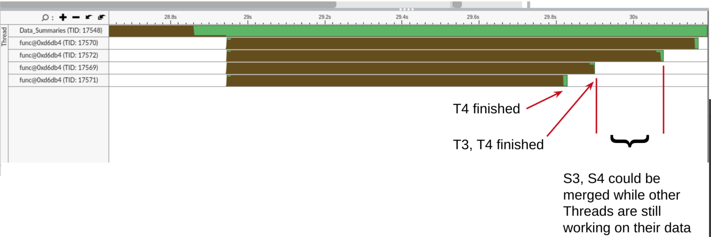
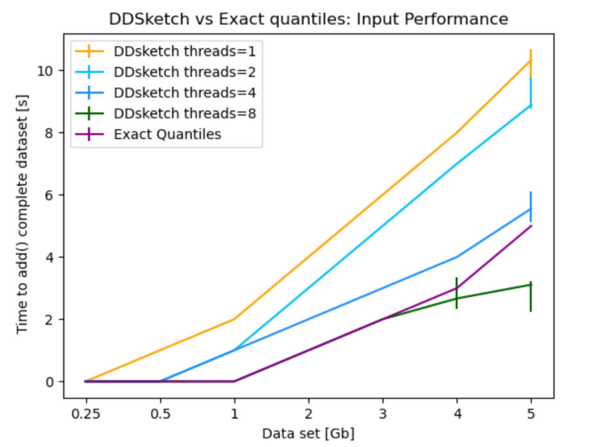
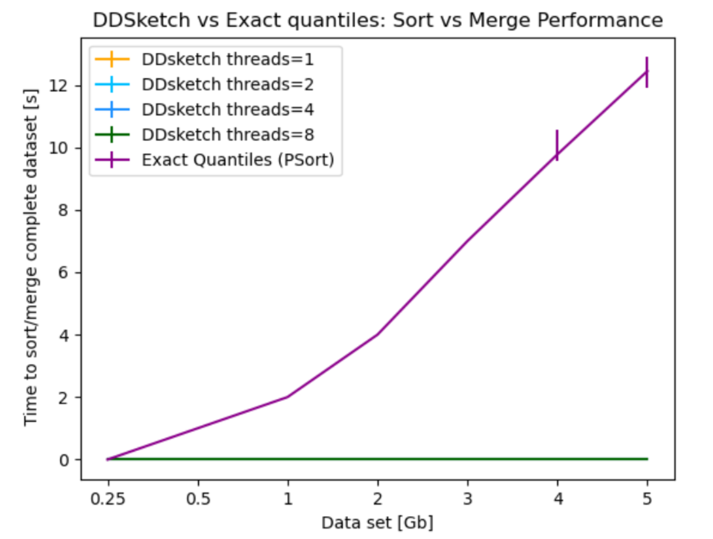

# Fast Quantiles for Data Summaries (Information Management Project WS-21/22)

This repository holds exact and an approximate quantile computation implementations written in C++.
The code was written by me for the Information Management Project.
I wrote, profiled and optimized the code as part of this class.
### Exact quantiles
This implementation is a very rudimentary, last-minute baseline, consisting of a vector which is sorted by several threads if need be.
It uses Threading Building Blocks for easy multithreading.
### Approximate Quantiles (DDSketch)
The approximate quantile solution is a port of the python-version of Datadog's [DDsketch](https://github.com/DataDog/sketches-py), 
specifically using the `dense_store` and `logarithmic_mapping`.

### Tests
`main.cpp` contains some `baseline`-functions, which have a python-equivalent in `ddsketch_pycomparison/mytest.py`.
### Optimization
The focus of this project was to write fast & scalable code.
There are however some optimization opportunities left on the table, as the DDSketch was already magnitudes faster.
I've marked some in the code.

Some were not worth the effort. Like in the image below, one could merge several DDSketches after they finish ingesting data, with the straggler-sketch being merged last.
DDSketch merging is however very efficient and not worth to optimize.

## Performance Comparison
The performance comparison between several DDSketches and the naive exact quantiles implementation shows that there are almost no downsides to using as much DDSketches as possible, as the time and space required for merges are very minimal.

### Miscellaneous
Also included are some data generators and readers.
